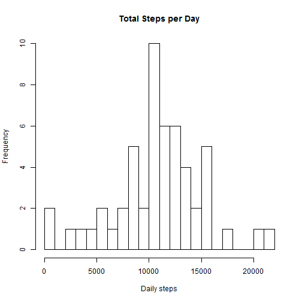
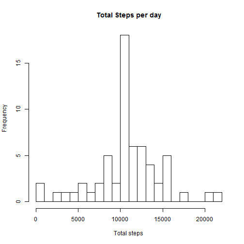
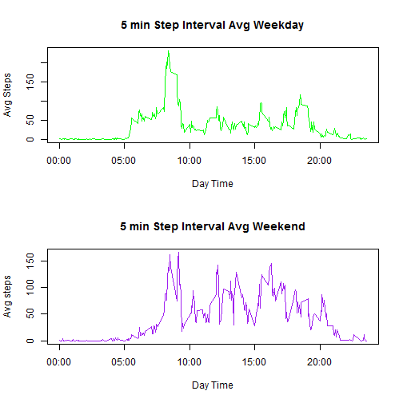

# Peer Review - Project 1 
It is now possible to collect a large amount of data about personal movement using activity monitoring devices such as a Fitbit, Nike Fuelband, or Jawbone Up. These type of devices are part of the "quantified self" movement -- a group of enthusiasts who take measurements about themselves regularly to improve their health, to find patterns in their behavior, or because they are tech geeks. But these data remain under-utilized both because the raw data are hard to obtain and there is a lack of statistical methods and software for processing and interpreting the data.

This assignment makes use of data from a personal activity monitoring device. This device collects data at 5 minute intervals through out the day. The data consists of two months of data from an anonymous individual collected during the months of October and November, 2012 and include the number of steps taken in 5 minute intervals each day

##Loading and preprocessing the data


```r
  setwd("C:/Users/EscapeForEver/Documents")
  Collected_Data <- read.csv("activity.csv")
```

## What is the mean of the total number of steps taken per day?
### Histogram

```r
hist(tapply(Collected_Data$steps, Collected_Data$date, sum), xlab = "Daily steps", breaks = 20, main = "Total Steps per Day")
```

 

### Mean and Median calculation for the total number of steps taken per day

```r
total_daily <- as.numeric(tapply(Collected_Data$steps, Collected_Data$date, sum))
step_mean <- mean(total_daily, na.rm = TRUE)
step_median <- median(total_daily, na.rm = TRUE)
step_mean
```

```
## [1] 10766.19
```

```r
step_median
```

```
## [1] 10765
```

*The mean and the median of total number of steps taken per day are 1.0766189 &times; 10<sup>4</sup> and 1.0765 &times; 10<sup>4</sup> respectively.

## What is the average daily activity pattern?
###  Time series plot -> 5-minute interval (x-axis) and the average number of steps taken, averaged across all days (y-axis)

```r
Collected_Data$interval <- as.factor(as.character(Collected_Data$interval))
interval_mean <- as.numeric(tapply(Collected_Data$steps, Collected_Data$interval, mean, na.rm = TRUE))
intervals <- data.frame(intervals = as.numeric(levels(Collected_Data$interval)), interval_mean)
intervals <- intervals[order(intervals$intervals), ]
label <- c("00:00", "05:00", "10:00", "15:00", "20:00")
label_seq <- seq(0, 2000, 500)
plot(intervals$intervals, intervals$interval_mean, type = "l", main = "Average steps 5-minute interval", ylab = "Average steps", xlab = "Time of day", xaxt ="n")
axis(side = 1, at = label_seq, label = label)
```

 

### Maximun number of steps -> in the 5-minute intervals, on average across all the days in the dataset

```r
intervals_Ordered <- intervals[order(intervals$interval_mean, decreasing = TRUE),]
head(intervals_Ordered)
```

```
##     intervals interval_mean
## 272       835      206.1698
## 273       840      195.9245
## 275       850      183.3962
## 274       845      179.5660
## 271       830      177.3019
## 269       820      171.1509
```

```r
max.interval <- intervals_Ordered$intervals[1[1]]
max.interval
```

```
## [1] 835
```

*The 5-minute interval with the highest average number of steps corresponds to the interval between 8:35 AM and 8:40 AM.

## Imputing missing values
There are a number of days/intervals where there are missing values (coded as NA). The presence of missing days may introduce bias into some calculations or summaries of the data.

### Total number of missing values in the dataset (NAs)

```r
dim(Collected_Data[is.na(Collected_Data$steps), ])[1]
```

```
## [1] 2304
```

### Potential strategy for filling in all of the missing values in the dataset
Replace the "NA"s (missing values) for the mean values in that 5-minute interval

```r
steps <- vector()
for (i in 1:dim(Collected_Data)[1]) {
    if (is.na(Collected_Data$steps[i])) {steps <- c(steps, intervals$interval_mean[intervals$intervals == Collected_Data$interval[i]])
    } else {steps <- c(steps, Collected_Data$steps[i])}}
```

### New dataset created with the missing data filled in

```r
activity_No_NA <- data.frame(steps = steps, date =Collected_Data$date, interval = Collected_Data$interval)  
```

### Histogram of the total number of steps taken each day and Calculate and report the mean and median total number of steps taken per day

```r
hist(tapply(activity_No_NA$steps, activity_No_NA$date, sum), xlab = "Total steps", breaks =20, main = "Total Steps per day")
```

 


```r
total_daily.new <- as.numeric(tapply(activity_No_NA$steps, activity_No_NA$date, sum))
step_mean.new <- mean(total_daily.new, na.rm = TRUE)
step_median.new <- median(total_daily.new, na.rm = TRUE)
step_mean.new
```

```
## [1] 10766.19
```

```r
step_median.new
```

```
## [1] 10766.19
```

#### Do the mean and median calculated values differ from the estimates from the first part of the assignment? What is the impact of imputing missing data on the estimates of the total daily number of steps?
The new mean and median of total number of steps taken per day are exactly equal. Because of the strategy chosen, there is no impact of imputing missing data on the estimates of the total daily number of steps.

## Are there differences in activity patterns between weekdays and weekends?
The weekdays() function may be of some help here. Use the dataset with the filled-in missing values for this part

### New factor variable created in the dataset with two levels - "weekday" and "weekend" indicating whether a given date is a weekday or weekend day.

```r
activity_No_NA$day.type <- c("weekend", "weekday", "weekday","weekday", "weekday", "weekday", "weekend")[as.POSIXlt(activity_No_NA$date)$wday + 1]
activity_No_NA$day.type <- as.factor(activity_No_NA$day.type)
week_day <- activity_No_NA[activity_No_NA$day.type == "weekday", ]
week_end <- activity_No_NA[activity_No_NA$day.type == "weekend", ]
weekday_means <- as.numeric(tapply(week_day$steps, week_day$interval, mean))
weekend_means <- as.numeric(tapply(week_end$steps, week_end$interval, mean))
intervals_day_kind <- data.frame(intervals =as.numeric(levels(Collected_Data$interval)), weekday_means, weekend_means)
intervals_day_kind <- intervals_day_kind[order(intervals_day_kind$intervals), ]
```

### Panel plot containing a time series plot -> 5-minute interval (x-axis) and the average number of steps taken, averaged across all weekday days or weekend days (y-axis)

```r
par <- par(mfrow = c(2, 1))
plot(intervals_day_kind$intervals, intervals_day_kind$weekday_means, type = "l", 
col = "Green", ylab = "Avg Steps", xlab = "Day Time", main = "5 min Step Interval Avg Weekday", xaxt = "n")
axis(side = 1, at = label_seq, label = label)
plot(intervals_day_kind$intervals, intervals_day_kind$weekend_means, type = "l", 
col = "Purple", ylab = "Avg steps", xlab = "Day Time", main = "5 min Step Interval Avg Weekend", xaxt = "n")
axis(side = 1, at = label_seq, label = label)
```

 


